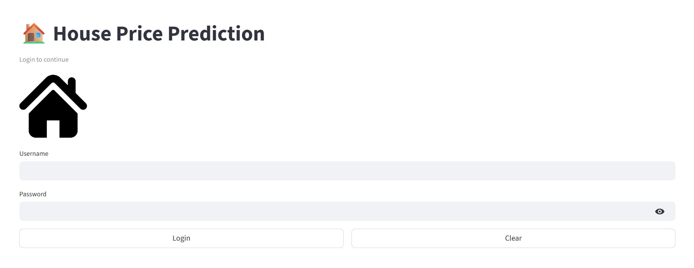
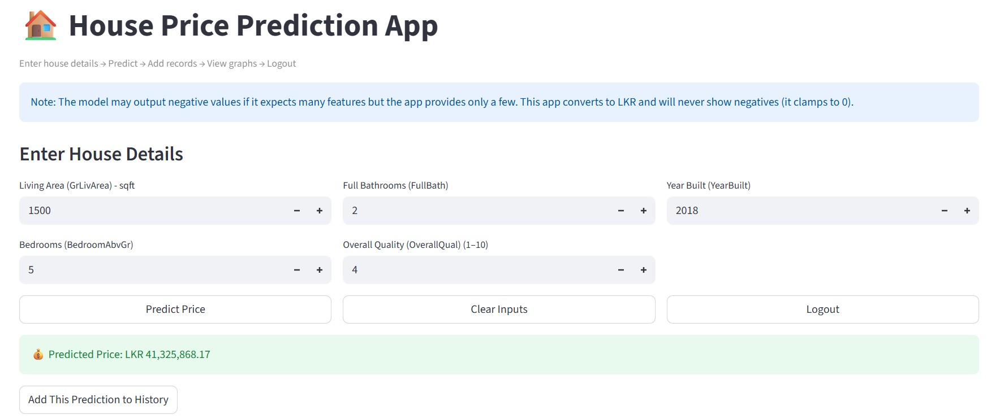

# 🏠 House Price Prediction Web App (ML + Streamlit)

## 👤 About Me

I am a **waiting intern** interested in **Machine Learning, Data Science, and AI-driven applications.** This project demonstrates my ability to build an end-to-end machine learning system with a working web application.

---

## 📌 Project Overview

This project is an **end-to-end House Price Prediction system** that combines:

* 📊 Machine Learning model (Random Forest Regression)
* 🧠 Data preprocessing and feature engineering
* 🌐 **Streamlit Web Application** with login, prediction, and visualization

Users can enter basic house details, get a predicted price, store predictions, and visualize results using interactive graphs.

---

## 🎯 Objective

To predict **house prices** based on key property features and provide a simple, user-friendly web interface for real-time predictions.

---

## 📂 Dataset

* **Source:** Kaggle House Prices Dataset
* File used:

```
data/raw/train.csv
```

---

## 🧠 Model & Methodology

### Features used:

* `GrLivArea` – Living area (sqft)
* `BedroomAbvGr` – Number of bedrooms
* `FullBath` – Number of full bathrooms
* `OverallQual` – Overall quality (1–10)
* `YearBuilt` – Year built

### Model:

* **Random Forest Regressor**
* Target variable was log-transformed (`log1p`) for stability
* Final predictions are converted back using `expm1`

### Saved model:

```
models/house_price_pipeline.joblib
```

---

## 🌐 Streamlit Web App Features

The app provides:

✔ Login page
✔ Input form for house features
✔ Predict button
✔ Conversion to **Sri Lankan Rupees (LKR)**
✔ No negative prices shown (clamped to 0)
✔ Add predictions to history
✔ Interactive graphs
✔ Clear inputs
✔ Logout functionality

Run the app with:

```bash
streamlit run app/app.py
```

Login credentials (demo):

```
Username: admin  
Password: 1234
```

---

## 🛠 Tech Stack

```
Python
Pandas
NumPy
Scikit-learn
Joblib
Streamlit
Matplotlib
Git & GitHub
```

---

## 📁 Folder Structure

```
house_price_prediction/
│
├── data/
│   └── raw/
│       └── train.csv
│
├── src/
│   └── train_small_model.py
│
├── models/
│   └── house_price_pipeline.joblib
│
├── app/
│   └── app.py
│
├── results/
│   └── screenshots/
│
├── requirements.txt
└── README.md
```

---

## ▶️ How to Run the Project

### Step 1 — Clone the repository

```bash
git clone https://github.com/YOUR_USERNAME/house_price_prediction.git
cd house_price_prediction
```

### Step 2 — Create virtual environment

```bash
python -m venv .venv
.venv\Scripts\activate   # Windows
```

### Step 3 — Install dependencies

```bash
pip install -r requirements.txt
```

### Step 4 — Train model (optional if model already exists)

```bash
python src/train_small_model.py
```

### Step 5 — Run the web app

```bash
streamlit run app/app.py
```

Open in browser:
👉 [http://localhost:8501](http://localhost:8501)

---

## 📸 Screenshots (Add these later)

Place images in:

```
results/screenshots/
```

Screenshots:

* Login page
### Login Page


* Prediction result
### Prediction Result


---

## 🚀 Future Improvements

* Add more features (location, lot size, etc.)
* Deploy online (Streamlit Cloud / Heroku)
* Improve UI design
* Use a more advanced model (XGBoost)
* Add user registration

---

## 👩‍💻 Contact

If you are interested in collaboration or internship opportunities, feel free to connect with me on GitHub.
